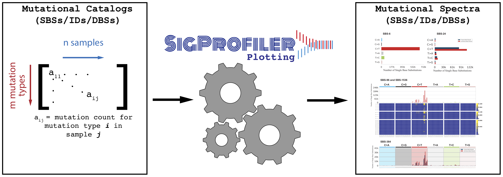

[](https://osf.io/2aj6t/wiki/home/) [](https://opensource.org/licenses/BSD-2-Clause) [](https://app.travis-ci.com/AlexandrovLab/SigProfilerPlotting)

# SigProfilerPlotting
SigProfilerPlotting provides a standard tool for displaying all types of mutational signatures as well as all types of mutational patterns in cancer genomes. The tool seamlessly integrates with other SigProfiler tools.

**INTRODUCTION**

The purpose of this document is to provide a guide for using the SigProfilerPlotting framework and associated functions/tools to visualize the output from SigProfilerExtraction and SigProfilerSimulator. An extensive Wiki page detailing the usage of this tool can be found at https://osf.io/2aj6t/wiki/home.

For users that prefer working in an R environment, a wrapper package is provided and can be found and installed from: https://github.com/AlexandrovLab/SigProfilerPlottingR



**PREREQUISITES**

The framework is written in PYTHON, however, it also requires the following software with the given versions (or newer):

  * PYTHON          version 3.4 or newer
  * SigProfilerMatrixGenerator (recommended)

**QUICK START GUIDE**

This section will guide you through the minimum steps required to plot mutational matrices:
1. Install the python package using pip:
```
                          pip install SigProfilerPlotting
```

2. From within a python session, you can now plot your mutational matrices as follows:
 ```python
$ python3
>> import sigProfilerPlotting as sigPlt
>> sigPlt.plotSBS(matrix_path, output_path, project, plot_type, percentage=False)
 ```
 The available functions are listed below and the layout of the required parameters are as follows:

      sigPlt.plotSBS(matrix_path, output_path, project, plot_type)

where matrix_path, output_path, project, and plot_type must be strings (surrounded by quotation marks, ex: "/Users/ebergstr/Desktop/test_sample").   

 3. The final plots are saved into the user-provided output folder.

## Single Base Substitution, Double Base Substitution, and Indel Plotting ##

**AVAILABLE FUNCTIONS**

```python
import sigProfilerPlotting as sigPlt

sigPlt.plotSBS(matrix_path, output_path, project, plot_type, percentage=False)
sigPlt.plotDBS(matrix_path, output_path, project, plot_type, percentage=False)
sigPlt.plotID(matrix_path, output_path, project, plot_type, percentage=False)

```

## Copy Number and Structural Variant Plotting ##

```python
import sigProfilerPlotting as sigPlt

matrix_path = "./sigProfilerPlotting/examples/input/breast_cancer_samples_example.CNV48.all" #Output of CNVMatrixGenerator
output_path = "./sigProfilerPlotting/examples/output/"
project = "Breast"
```

**AVAILABLE FUNCTIONS**

*Multi-page pdf of CNV or SV signatures*

```python
sigPlt.plotCNV(matrix_path, output_path, project, percentage=True, aggregate=False) #plotting of CNV signatures
sigPlt.plotSV(matrix_path, output_path, project, percentage=True, aggregate=False) #plotting of SV signatures

```
*Multi-page pdf of CNV or SV counts*

```python
sigPlt.plotCNV(matrix_path, output_path, project, percentage=False, aggregate=False) #plotting of CNV counts
sigPlt.plotSV(matrix_path, output_path, project,percentage=False, aggregate=False) #plotting of SV counts
```

*Single pdf of CNV or SV counts per sample for a given cancer type/project*

```python
sigPlt.plotCNV(matrix_path, output_path, project, percentage=False, aggregate=True) #plotting of CNV counts
sigPlt.plotSV(matrix_path, output_path, project, percentage, aggregate=True) #plotting of SV counts
```

matrix_path -> path to the mutational matrix of interest

output_path -> desired output path

project -> name of unique sample set

plot_type -> context of the mutational matrix (96, 192, 78, 94, etc.)

percentage -> Boolean: plot the mutational matrix as percentages of the sample's total mutation count. Default is False

To create a sample portrait, ensure that you have a matrix for all required contexts (SBS-6, SBS-24, SBS-96, SBS-384, SBS-1536, DBS-78, DBS-312, ID-83, ID-28, ID-96)

```python
from sigProfilerPlotting import sample_portrait as sP
sP.samplePortrait(sample_matrices_path, output_path, project, percentage=False)
```

**EXAMPLE**

This package comes with an example test for each plot type. Run the script plot_example.py from within the examples directory in the downloaded repo after installation:
```python
python3 sigProfilerPlotting/examples/plot_example.py
```

This example will create plots for each context for each of the included four samples. These plots will be saved within the `sigProfilerPlotting/examples/output/` folder.

**CITATION**

Bergstrom EN, Huang MN, Mahto U, Barnes M, Stratton MR, Rozen SG, Alexandrov LB: SigProfilerMatrixGenerator: a tool for visualizing and exploring patterns of small mutational events. BMC Genomics 2019, 20:685
https://bmcgenomics.biomedcentral.com/articles/10.1186/s12864-019-6041-2

**COPYRIGHT**

Copyright (c) 2020, Erik Bergstrom [Alexandrov Lab] All rights reserved.

Redistribution and use in source and binary forms, with or without modification, are permitted provided that the following conditions are met:

Redistributions of source code must retain the above copyright notice, this list of conditions and the following disclaimer.

Redistributions in binary form must reproduce the above copyright notice, this list of conditions and the following disclaimer in the documentation and/or other materials provided with the distribution.

THIS SOFTWARE IS PROVIDED BY THE COPYRIGHT HOLDERS AND CONTRIBUTORS "AS IS" AND ANY EXPRESS OR IMPLIED WARRANTIES, INCLUDING, BUT NOT LIMITED TO, THE IMPLIED WARRANTIES OF MERCHANTABILITY AND FITNESS FOR A PARTICULAR PURPOSE ARE DISCLAIMED. IN NO EVENT SHALL THE COPYRIGHT HOLDER OR CONTRIBUTORS BE LIABLE FOR ANY DIRECT, INDIRECT, INCIDENTAL, SPECIAL, EXEMPLARY, OR CONSEQUENTIAL DAMAGES (INCLUDING, BUT NOT LIMITED TO, PROCUREMENT OF SUBSTITUTE GOODS OR SERVICES; LOSS OF USE, DATA, OR PROFITS; OR BUSINESS INTERRUPTION) HOWEVER CAUSED AND ON ANY THEORY OF LIABILITY, WHETHER IN CONTRACT, STRICT LIABILITY, OR TORT (INCLUDING NEGLIGENCE OR OTHERWISE) ARISING IN ANY WAY OUT OF THE USE OF THIS SOFTWARE, EVEN IF ADVISED OF THE POSSIBILITY OF SUCH DAMAGE.

**CONTACT INFORMATION**

Please address any queries or bug reports to Erik Bergstrom at ebergstr@eng.ucsd.edu
